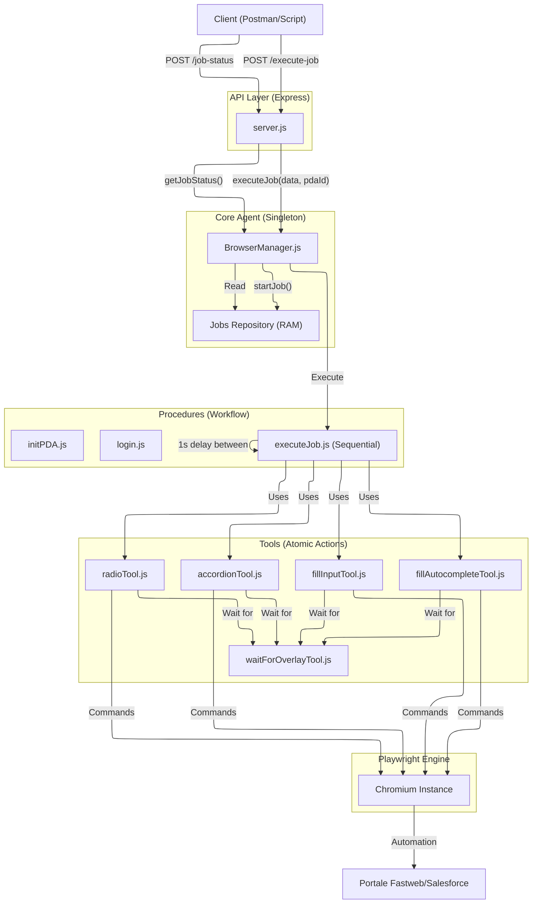

# John Holmes - Fastweb Automation Project

Questo progetto è un sistema di automazione avanzato basato su **Playwright** e **Node.js** per interagire con il portale Fastweb/Salesforce. Funge da server API che espone funzionalità di navigazione, login e compilazione automatica di pratiche (PDA).

## 📚 Indice
1. [Requisiti e Installazione](#requisiti)
2. [Avvio del Server](#avvio-del-server)
3. [Architettura](#architettura)
4. [Tool di Automazione (Core)](#tool-di-automazione)
5. [Procedure](#procedure)
6. [API Reference](#api-reference)

---

## Requisiti

- Node.js (v14+)
- NPM
- Dipendenze: `npm install`

## Avvio del Server

Per avviare il server API sulla porta **3000**:

```bash
# Avvio standard
npm start

# Avvio in modalità sviluppo (auto-reload)
npm run dev
```

---

## Architettura

Il progetto è strutturato in moduli:
- **`src/server.js`**: Entry point Express.js.
- **`src/browserManager.js`**: Singleton che gestisce l'istanza del browser Chromium.
- **`src/tools/`**: Libreria di funzioni atomiche per interagire con la pagina (click, fill, wait).
- **`src/procedures/`**: Script complessi che orchestrano più tool per completare task (es. Login, Init PDA, Execute Job).

### Schema di Flusso


---

## Tool di Automazione

Questi tool si trovano in `src/tools/` e sono progettati per essere **resilienti** (Retry Logic) e **consapevoli** (Overlay Detection).

### 🛡️ Filosofia "Resiliente"
Tutti i tool di interazione (`fill`, `click`, `select`) implementano:
1.  **Retry Automatico**: Se un'azione fallisce (es. elemento non cliccabile), il sistema riprova fino a `TOOLS_RETRY` volte (configurabile in `config.json`) con backoff esponenziale.
2.  **Overlay Detection**: Dopo ogni azione, il tool controlla automaticamente se la pagina ha attivato un caricamento (`#overlay` di Fastweb) e attende che finisca prima di restituire il controllo.

### Lista Tool Principali

#### 1. `fillInputTool.js`
Inserisce testo in un campo input standard.
- **Uso**: `await fillInput(page, locator, value)`
- **Feature**: Attesa visibilità, pulizia campo, retry, attesa overlay.

#### 2. `fillAutocompleteTool.js`
Gestisce i campi con menu a tendina di ricerca (es. Comune).
- **Uso**: `await fillAutocomplete(page, locator, value)`
- **Feature**: Digita, attende menu, **match rigoroso** (esatto), click, attesa overlay.

#### 3. `radioTool.js`
Seleziona pulsanti radio in modo sicuro.
- **Uso**: `await checkRadioButton(page, locator)`
- **Feature**: Controllo stato (evita doppi click), force check, retry, attesa overlay.

#### 4. `selectOptionTool.js`
Gestisce i menu a tendina classici (`<select>`).
- **Uso**: `await selectOption(page, locator, value)`
- **Feature**: Attesa options, retry, attesa overlay.

#### 5. `accordionTool.js`
Apre/Chiude pannelli accordion.
- **Uso**: `await setAccordionState(page, sectionName, desiredState)`
- **Feature**: Cerca per testo, verifica stato attuale (`aria-expanded`), agisce solo se necessario.

#### 6. `waitForOverlayTool.js`
Tool di basso livello usato da tutti gli altri.
- **Uso**: `await waitForOverlay(page)`
- **Funzione**: Monitora il DOM per l'elemento `#overlay`. Se appare, blocca l'esecuzione finché non sparisce.

---

## Procedure

Le procedure (`src/procedures/`) uniscono i tool per flow complessi.

### `initPDA.js`
Inizializza una nuova pratica.
1.  Naviga a Global Search.
2.  Clicca "Inserisci Ordine".
3.  Seleziona Prodotto "IS.0228.0601NA".
4.  Attende URL "CPQOrder".
5.  **Reset Accordion**: Chiude forzatamente tutti i pannelli per garantire uno stato pulito.

### 🛡️ Global Job Lock
Per garantire la sicurezza e la consistenza dei dati, il sistema implementa un **Global Job Lock**.
- **Comportamento**: Quando un job è in esecuzione (o una procedura critica come login/logout/initPDA), il browser viene "bloccato".
- **Conflitti**: Qualsiasi tentativo di avviare un altro job o procedura riceverà un errore **409 Conflict** (`BUSY`).
- **Override**: È possibile forzare l'esecuzione passando `"force": true` nel body della richiesta JSON.

---

## API Reference

Il server espone i seguenti endpoint **POST** per garantire coerenza e sicurezza:

### 1. Gestione Browser
- **`/open-browser`**: Apre il browser e naviga all'URL specificato (`{ "url": "..." }`).
- **`/close-browser`**: Chiude il browser. Supporta `{ "force": true }` per chiudere anche sessioni attive.

### 2. Sessione e Login
- **`/login`**: Effettua il login usando le credenziali in `config.json`. Supporta `{ "force": true }`.
- **`/secure-logout`**: Esegue il logout sicuro navigando su Global Search e cliccando "Esci".
- **`/api/session-status`**: Restituisce o imposta lo stato della sessione (`{ "logged": boolean }`).

### 3. Procedure PDA
- **`/pda-init`**: Inizializza una nuova pratica (navigazione e reset accordion).
- **`/execute-job`**: Esegue una sequenza lineare di azioni in background. Restituisce un `pdaId`.
    ```json
    {
      "pdaId": "id-univoco",
      "actions": [
        { "type": "open_accordion", "name": "Dati Anagrafici" },
        { "type": "fill", "locator": "input[name='...']", "value": "Test" }
      ]
    }
    ```

### 4. Monitoraggio Job
- **`/job-status`**: Restituisce il progresso di un job. Body: `{ "pdaId": "..." }`.
- **`/jobs`**: Restituisce la lista di tutti i job gestiti nella sessione corrente.

### 5. Debug e Ispezione
- **`/current-page`**: Restituisce URL e titolo della pagina corrente.
- **`/page-screenshot`**: Restituisce uno screenshot della pagina in formato **Base64**.
- **`/page-code`**: Restituisce l'intero codice **HTML** della pagina corrente.

---

## Note Tecniche

- **Singleton Browser**: Gestito da `browserManager.js`.
- **Session State**: Persistito in `session_state.json`.
- **Config**: `config.json` (include le opzioni `"HEADLESS": true/false`, `"TOOLS_RETRY": n`).
- **Config Loader**: Centralizzato in `src/utils/configLoader.js` per garantire coerenza tra i moduli.
