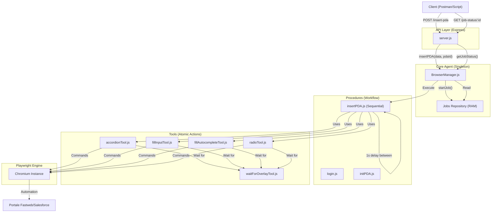

# John Holmes - Fastweb Automation Project

Questo progetto è un sistema di automazione avanzato basato su **Playwright** e **Node.js** per interagire con il portale Fastweb/Salesforce. Funge da server API che espone funzionalità di navigazione, login e compilazione automatica di pratiche (PDA).

## 📚 Indice
1. [Requisiti e Installazione](#requisiti)
2. [Avvio del Server](#avvio-del-server)
3. [Architettura](#architettura)
4. [Tool di Automazione (Core)](#tool-di-automazione)
5. [Procedure](#procedure)
6. [Mappatura Locatori](#mappatura-locatori)
7. [API Reference](#api-reference)

---

## Requisiti

- Node.js (v14+)
- NPM
- Dipendenze: `npm install`

## Avvio del Server

Per avviare il server API sulla porta **3000**:

```bash
# Avvio standard
npm start

# Avvio in modalità sviluppo (auto-reload)
npm run dev
```

---

## Architettura

Il progetto è strutturato in moduli:
- **`src/server.js`**: Entry point Express.js.
- **`src/utils/browserManager.js`**: Singleton che gestisce l'istanza del browser Chromium.
- **`src/tools/`**: Libreria di funzioni atomiche per interagire con la pagina (click, fill, wait).
- **`src/procedures/`**: Script complessi che orchestrano più tool per completare task (es. Login, Init PDA).
- **`stuff/pda_data.json`**: Mapping JSON dei selettori e dei dati.

### Schema di Flusso


---

## Tool di Automazione

Questi tool si trovano in `src/tools/` e sono progettati per essere **resilienti** (Retry Logic) e **consapevoli** (Overlay Detection).

### 🛡️ Filosofia "Resiliente"
Tutti i tool di interazione (`fill`, `click`, `select`) implementano:
1.  **Retry Automatico**: Se un'azione fallisce (es. elemento non cliccacbile), il sistema riprova fino a 3 volte con backoff esponenziale.
2.  **Overlay Detection**: Dopo ogni azione, il tool controlla automaticamente se la pagina ha attivato un caricamento (`#overlay` di Fastweb) e attende che finisca prima di restituire il controllo.

### Lista Tool Principali

#### 1. `fillInputTool.js`
Inserisce testo in un campo input standard.
- **Uso**: `await fillInput(page, locator, value)`
- **Feature**: Attesa visibilità, pulizia campo, retry, attesa overlay.

#### 2. `fillAutocompleteTool.js`
Gestisce i campi con menu a tendina di ricerca (es. Comune).
- **Uso**: `await fillAutocomplete(page, locator, value)`
- **Feature**: Digita, attende menu, **match rigoroso** (esatto), click, attesa overlay.

#### 3. `radioTool.js`
Seleziona pulsanti radio in modo sicuro.
- **Uso**: `await checkRadioButton(page, locator)`
- **Feature**: Controllo stato (evita doppi click), force check, retry, attesa overlay.

#### 4. `selectOptionTool.js`
Gestisce i menu a tendina classici (`<select>`).
- **Uso**: `await selectOption(page, locator, value)`
- **Feature**: Attesa options, retry, attesa overlay.

#### 5. `accordionTool.js`
Apre/Chiude pannelli accordion.
- **Uso**: `await setAccordionState(page, sectionName, desiredState)`
- **Feature**: Cerca per testo, verifica stato attuale (`aria-expanded`), agisce solo se necessario.

#### 6. `waitForOverlayTool.js`
Tool di basso livello usato da tutti gli altri.
- **Uso**: `await waitForOverlay(page)`
- **Funzione**: Monitora il DOM per l'elemento `#overlay`. Se appare, blocca l'esecuzione finché non sparisce.

---

## Procedure

Le procedure (`src/procedures/`) uniscono i tool per flow complessi.

### `initPDA.js`
Inizializza una nuova pratica.
1.  Naviga a Global Search.
2.  Clicca "Inserisci Ordine".
3.  Seleziona Prodotto "IS.0228.0601NA".
4.  Attende URL "CPQOrder".
5.  **Reset Accordion**: Chiude forzatamente tutti i pannelli per garantire uno stato pulito. Fallisce se non riesce.

---

## Mappatura Locatori

Il file `stuff/pda_data.json` contiene la mappatura dei campi.
Ogni campo è definito da:
- **`locator`**: Selettore CSS (es. `input[name="..."]`).
- **`type`**: Tipo di tool da usare (`text`, `radio`, `select`, `autocomplete`).
- **`value`**: Valore di default o test.

---

## API Reference

Il server espone i seguenti endpoint POST:

### 1. Apri Browser
- **URL**: `/open-browser`
- **Body**: `{ "url": "..." }`

### 2. Login
- **URL**: `/login`
- **Body**: `{ "username": "...", "password": "..." }`

### 3. Logout Sicuro
- **URL**: `/secure-logout`

### 4. Stato Pagina
- **URL**: `/current-page`

### 5. Chiudi Browser
- **URL**: `/close-browser`
- **Body**: `{ "force": true }`

### 6. Stato Sessione
- **URL**: `/api/session-status`

### 7. Inizializza PDA
- **URL**: `/pda-init`
- **Descrizione**: Avvia la procedura PDA, naviga e resetta gli accordion.

### 8. Inserimento PDA (Sequenza Async)
- **URL**: `/insert-pda`
- **Body**: 
  ```json
  {
    "pdaId": "mio-id-personalizzato",
    "actions": [
      { "type": "open_accordion", "name": "Dati Anagrafici" },
      { "type": "fill", "locator": "input[name='...']", "value": "John" },
      { "type": "radio", "locator": "input[value='M']" },
      { "type": "wait", "value": 2000 }
    ]
  }
  ```
- **Azioni Supportate**:
  | Azione (`type`) | Descrizione | Parametri |
  | :--- | :--- | :--- |
  | `open_accordion` | Apre un pannello fisarmonica | `name` (o `value`) |
  | `close_accordion` | Chiude un pannello fisarmonica | `name` (o `value`) |
  | `fill` / `text` | Inserisce testo in un input | `locator`, `value` |
  | `autocomplete` | Gestisce menù di ricerca | `locator`, `value` |
  | `radio` | Seleziona un pulsante radio | `locator` |
  | `select` | Seleziona da menù a tendina | `locator`, `value` |
  | `click` / `button` | Clicca un elemento generico | `locator` |
  | `wait` | Attesa in millisecondi | `value` (o `ms`) |

- **Descrizione**: Esegue una sequenza lineare di azioni in background. Restituisce un `pdaId`.
- **Note**: Tra un'operazione e l'altra viene inserita automaticamente un'attesa di **1 secondo** per garantire la stabilità. È possibile passare un `pdaId` personalizzato; se già in esecuzione, restituirà errore 409.

### 9. Stato Job
- **URL**: `/job-status/:id`
- **Method**: GET
- **Descrizione**: Restituisce il progresso e lo stato di un job in background tramite il suo `pdaId`.

### 10. Screenshot
- **URL**: `/page-screenshot` (o `/screenshot`)

### 11. Codice Pagina
- **URL**: `/page-code`

---

## Test e Script

- **Test**: `node test/full_flow_test.js`
- **Debug Manuale**: `node scripts/interactive_browser.js`

## Note Tecniche

- **Singleton Browser**: Gestito da `browserManager.js`.
- **Session State**: Persistito in `session_state.json`.
- **Config**: `config.json`.
